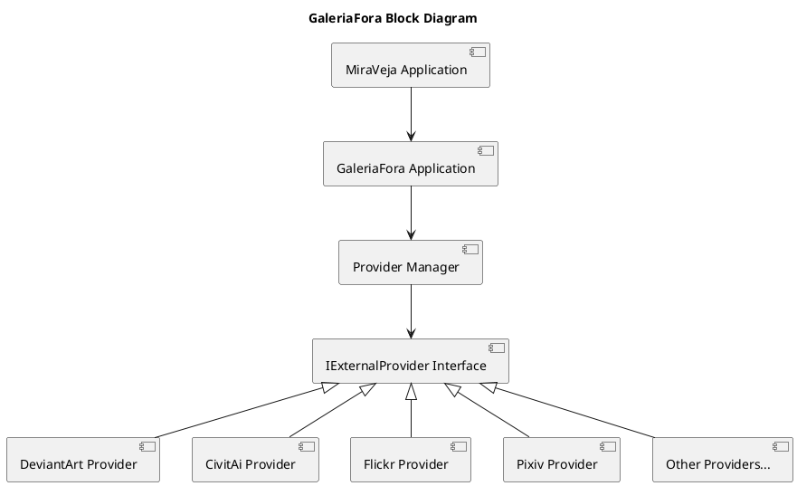

# 🎨 GaleriaFora

[](https://www.python.org/)
[](LICENSE)
[](https://github.com/psf/black)
[](https://codecov.io/gh/JomarJunior/galeriafora)
[](#-development-status)
[](https://github.com/JomarJunior/galeriafora/actions)


> A microservice for integrating third-party galleries into the **🖼️ MiraVeja** ecosystem

**Etymology**: Combining portuguese words "Galeria" (Gallery) and "Fora" (Outside) to reflect the service's role in bringing external galleries into **🖼️ MiraVeja**.

## 🚀 Overview

GaleriaFora enables users to connect, manage, and surface third-party galleries inside the **🖼️ MiraVeja** platform. It provides streamlined tools to fetch, download, and upload gallery content from external providers so users can integrate external artwork seamlessly into their **🖼️ MiraVeja** experience.

GaleriaFora is not a standalone gallery frontend or scraping framework. It is an integration layer focused on normalizing external gallery behavior for use inside **🖼️ MiraVeja**.

## ✨ Key Features

- 🎯 **Third-party fetch**: Retrieve gallery lists and media from external providers (DeviantArt, etc.).
- 🔁 **Two-way sync**: Download assets to **🖼️ MiraVeja** and upload/manage content on external sources.
- 🔌 **Pluggable providers**: Add new gallery sources via well-defined entry points.
- 🧩 **UI-friendly integration**: Designed to fit **🖼️ MiraVeja**’s UX patterns for a consistent user experience.

## 🛠️ Technology & Integrations

- **Core runtime**: Python 3.10+ with async-friendly code patterns
- **Provider pattern**: Easily add hexagonal adapters for new gallery services
- **Storage**: Configurable local or external storage backends for cached media
- **Ecosystem integration**: Built to be imported or deployed as part of the **🖼️ MiraVeja** ecosystem

## 🛠️ Technology Stack

### 🐍 Core Runtime

- **Python 3.10** - Stable and widely supported version
- **FastAPI** - Modern async web framework for REST APIs
- **Uvicorn** - ASGI server with async support

### 🏗️ Infrastructure

- **Pydantic** - Data validation and settings management
- **httpx** - Async HTTP client for provider integrations

### 🧪 Development

- **pytest** - Testing framework with async support
- **black** - Code formatter
- **pylint** - Code quality checker
- **pre-commit** - Git hooks for code quality and formatting

## 🏛️ Architecture

GaleriaFora is structured around a core domain model that defines the `IExternalProvider` interface and related data structures. Providers implement this interface to connect to specific gallery services, while the application layer manages provider discovery, configuration, and orchestration of media fetching and uploading operations. It follows Domain-Driven Design principles to keep the core logic decoupled from external service implementations, allowing for easy extensibility and maintenance.

```bash
src/galeriafora/
├── __init__.py
├── configuration/      # Configuration management and provider discovery
├── domain/             # Core domain models and provider interface
├── application/        # Use cases and orchestration logic
├── infrastructure/     # External service clients and storage backends
└── api/                # REST endpoints
```

### 🧱 Block Diagram



## 📡 Communication Protocols

1. **REST** - For external API endpoints and **🖼️ MiraVeja** integration
2. **Internal Python API** - For provider implementations and application logic

## 🚀 Getting Started

These instructions assume you have Python 3.10+ installed and a working **🖼️ MiraVeja** development environment.

1. Create a virtual environment and install dependencies (example with `venv`):

```bash
# Create virtual environment
python -m venv .venv
# Activate virtual environment
source .venv/bin/activate
# Install Poetry
pip install poetry
# Install project dependencies
poetry install
```

2. Configure provider credentials and endpoints using environment variables or the project's config file.

3. Start the service or import GaleriaFora components into MiraVeja as needed.

## ⚙️ Configuration

Configure the service using environment variables or a configuration file. Key settings include:

```bash
# In construction...
```

## 🧭 Usage

- Add or configure providers via `pyproject.toml` entry points.
- Install provider-specific dependencies as needed (e.g., `poetry add galeriafora-deviantart`).
- The GaleriaFora service will automatically discover and load configured providers at runtime, making their functionality available through **🖼️ MiraVeja**’s UI and APIs.

```toml
# Example provider configuration in pyproject.toml
[tool.poetry.dependencies]
galeriafora-deviantart = "^0.1.0"
```

## 📝 Writing Providers

To create a new gallery provider, implement the `IExternalProvider` interface defined in `galeriafora.domain` and register it as an entry point under the `galeriafora.providers` group in your package’s `pyproject.toml`.

```python
from typing import Optional, Sequence
from galeriafora.domain import IExternalProvider, ExternalMedia, ExternalProviderInfo, ProviderCapability, Page, ProviderName
from galeriafora_deviantart import DeviantArtClient

class DeviantArtExternalProvider(IExternalProvider):
    def __init__(self, client: DeviantArtClient):
        # Initialize with any necessary clients or configuration
        self.client = client

    @property
    def info(self) -> ExternalProviderInfo:
        return ExternalProviderInfo(
            name=ProviderName("deviantart"), # Normalizes to correct regex pattern (DeviantArt, deviant-art, DeViAnArT -> "deviantart")
            description="Fetch and manage galleries from DeviantArt",
            capabilities=set([
                ProviderCapability.FETCH_LATEST,
                ProviderCapability.FETCH_BY_USER,
                ProviderCapability.FETCH_BY_TAGS,
                ProviderCapability.UPLOAD,
            ])
        )

    async def fetch_latest(self, *, limit: int = 200, cursor: Optional[str] = None) -> Page[ExternalMedia]:
        # Implement media fetching logic
        pass

    async def fetch_by_user(self, username: str, *, limit: int = 200, cursor: Optional[str] = None) -> Page[ExternalMedia]:
        # Implement gallery fetching logic
        pass

    async def fetch_by_tags(self, tags: Sequence[str], *, limit: int = 200, cursor: Optional[str] = None) -> Page[ExternalMedia]:
        # Implement tag-based media fetching logic
        pass

    async def upload(self, media: Sequence[ExternalMedia]) -> None:
        # Implement media upload logic
        pass
```

Provider names must be lowercase, stable identifiers.
Display-friendly names should be handled by the UI layer.

### 🛠️ Provider Capabilities

Providers must explicitly declare which operations they support via `ProviderCapability`.

The application layer will only call methods advertised by a provider’s declared capabilities.

## 🧪 Testing

- Run tests with `pytest`:

```bash
poetry run pytest
```

### 🧪 Provider Testing

Provider implementations are expected to be tested against the IExternalProvider contract.

## 📚 Documentation

... to be added...

## 🚧 Development Status

**Planning Phase** - Architecture and design in progress

## 📄 License

MIT License — see the LICENSE file for details.

## 👨‍💻 Author

Jomar Júnior de Souza Pereira — <jomarjunior@poli.ufrj.br>

## 🔗 Links

- [🏛️ Architecture Document](docs/architecture.md) - Detailed design and architecture decisions
- [🖼️ MiraVeja](https://github.com/jomarjunior/miraveja) - The main image gallery and management platform
- [🧠 ModelMora](https://github.com/jomarjunior/modelmora) - The AI model management and deployment platform
- [💬 DescriDiva](https://github.com/jomarjunior/descridiva) - The AI-powered image description and captioning tool

---

Part of the **🖼️ MiraVeja** ecosystem — built to make gallery integration simple and extensible.
